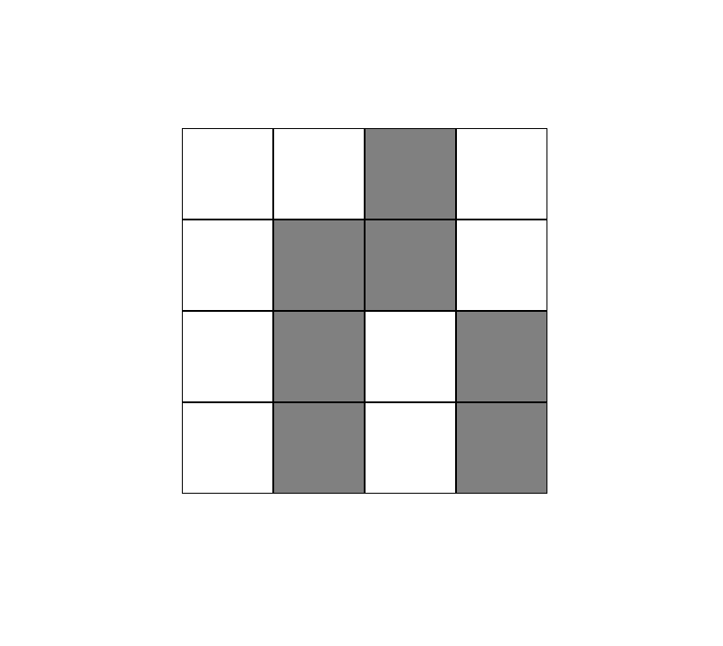

# React - Lights Out
Simple logic puzzle / game where each cell is lit or unlit. Clicking a cell switches that cell and each adjacent cell on / off. The object is to turn all the cells "off."

  

## Running the App
1) Clone repo: `git clone https://github.com/mpike91/React-LightsOut.git`
2) Move into directory: `cd React-LightsOut/`
3) Install npm: `npm install`
4) Start app: `npm start`

## My Contribution
No starter code was given to me. I started with the boilerplate code from create react app.